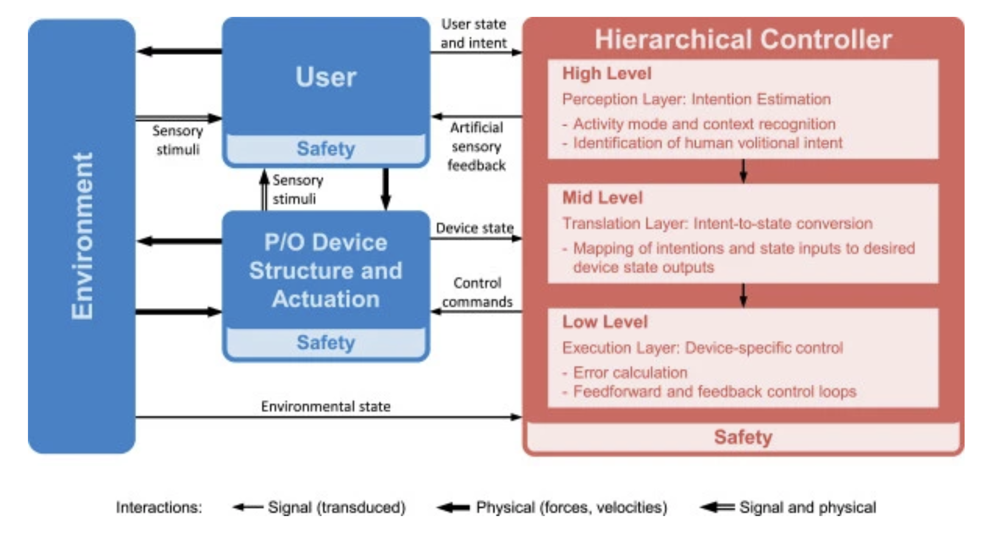
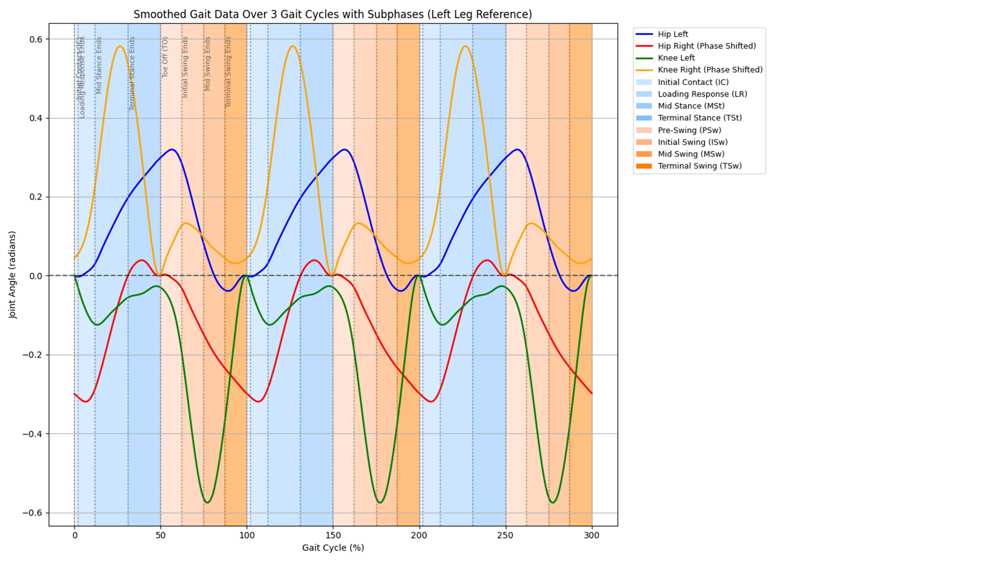
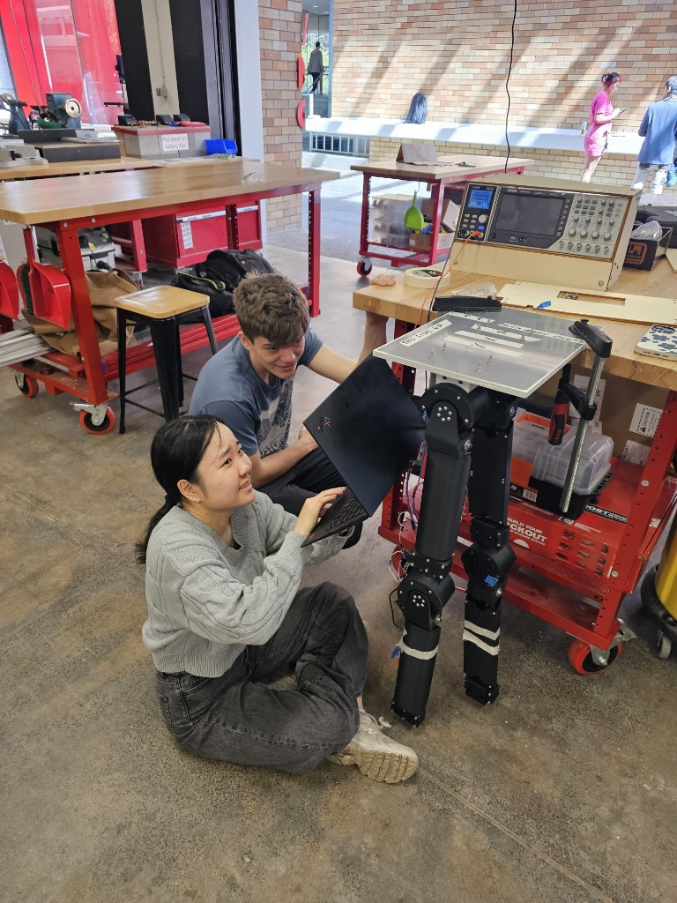
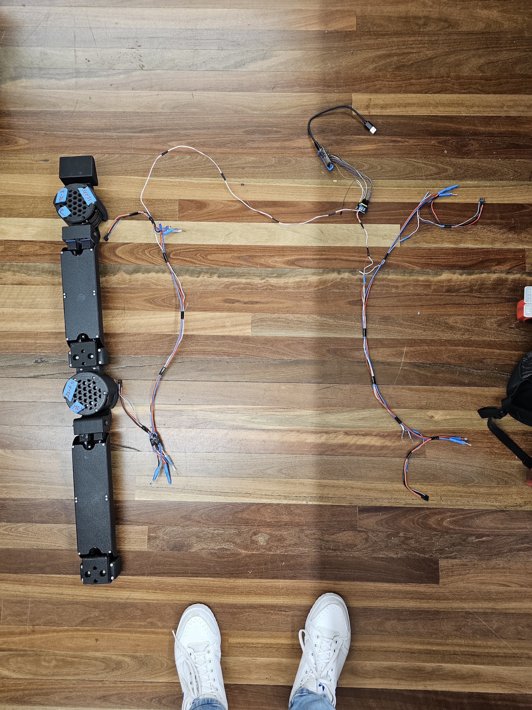

> **Public case study** — firmware and simulations below are a curated thesis snapshot; full team codebase is private.

---

## Problem statement

An assistive lower-limb exoskeleton needed **gait-aware control** and **bench-validated actuators** before anyone could safely integrate four high-torque drives on a wearer.

## High-level impact

- **Eight-phase gait FSM** per leg aligned to standard locomotion sub-phases.
- **Four CubeMars actuators** (hip/knee L/R) commanded over **CAN at 1 Mbps**.
- **ESP32-S3 HIL rig** for **~1 kHz PID** validation with gait trajectory replay.
- **Five-person team**, **12 sensors** integrated across firmware and bench testing.
- Graduate thesis documented: [Thesis PDF](docs/ThesisC_Tanmeet_Z5510198.pdf).

## My contribution

- **Control Systems Lead**: owned gait FSM design, CAN motor command path, HIL bring-up, and MATLAB/Simulink models (PID, battery, fall detection).
- Coordinated sensor integration and firmware milestones with the thesis team.
- Connected modelling → embedded implementation → physical test.

## Tech and design choices

| Choice | Why |
| --- | --- |
| **Per-phase FSM states** (vs single stance/swing split) | Finer gait phases matched assist timing requirements for hip/knee. |
| **MCP2515 / CAN** to CubeMars | Team motor ecosystem; deterministic broadcast-style command path. |
| **ESP32-S3 HIL before on-body** | De-risked PID and trajectory timing without wearing the full exo. |
| **MATLAB/Simulink** alongside Arduino | Faster policy and safety logic iteration before flashing embedded targets. |

## Lesson / twist

**State transitions** that looked correct in simulation **hunted on hardware** when sensor timestamps and CAN latency differed — fixed by aligning transition guards with measured loop time and validating on the HIL rig with logged phase entry/exit, not FSM logic alone on the bench.

---

# Control Systems for Exoskeleton

**Graduate Thesis · UNSW Mechatronics Engineering**

Control-systems work for the **EASE (Assistive Exoskeleton)** project — gait-phase state machines, CubeMars actuator control over CAN, ESP32-S3 hardware-in-the-loop (HIL) testing, and MATLAB/Simulink simulations for joint PID, battery sizing, and fall detection.

**Author:** Tanmeet Singh Sachdeva · Control Systems Lead  
**Institution:** UNSW Sydney · Mechatronic Engineering (Honours)

**Thesis report:** [ThesisC_Tanmeet_Z5510198.pdf](docs/ThesisC_Tanmeet_Z5510198.pdf)

> Team thesis project (EASE Exoskeleton). This repository is a curated public snapshot of firmware, simulations, and documentation from my control-systems contribution — not the full private team codebase.

---

## Project overview

The EASE exoskeleton assists lower-limb movement during walking. My thesis focus was the **control layer**: translating gait phases into joint position/velocity/torque commands for four CubeMars actuators (left/right hip and knee), validating controllers on an **ESP32-S3 HIL rig** before on-body integration, and modelling behaviour in MATLAB.

```
  Gait sensors / IMU          MATLAB / Simulink
        │                           │
        ▼                           ▼
  ┌─────────────────────────────────────────┐
  │  Gait finite-state machine (Arduino)    │
  │  8-phase locomotion model per leg       │
  └──────────────────┬──────────────────────┘
                     │ CAN (1 Mbps)
                     ▼
  ┌─────────────────────────────────────────┐
  │  CubeMars actuators × 4                 │
  │  hip L/R · knee L/R                     │
  └─────────────────────────────────────────┘

  HIL path: ESP32-S3 + PlatformIO ──► same CAN command format, 1 kHz PID loop
```

---

## Repository layout

| Path | Description |
| ---- | ----------- |
| [`firmware/ease-main/`](firmware/ease-main/) | Arduino Mega gait controller — 8-state FSM, MCP2515 CAN, force sensors |
| [`firmware/hil-motor-control/`](firmware/hil-motor-control/) | HIL sketch — replays gait profile arrays to four motors over CAN |
| [`firmware/ease-control-systems/`](firmware/ease-control-systems/) | ESP32-S3 PlatformIO / ESP-IDF project scaffold for HIL bring-up |
| [`firmware/draft/`](firmware/draft/) | Early prototypes — PID tests, old 4-state FSM, gait plotting script |
| [`matlab/`](matlab/) | Simulations — joint PID, exoskeleton FSM, battery discharge, fall detection |
| [`docs/`](docs/) | Thesis report (PDF) and figures |
| [`docs/images/`](docs/images/) | Control architecture, HIL testing rig, gait cycle |
| [`setup/`](setup/) | ESP-IDF devcontainer and Windows USB/WSL flashing guide |

---

## Firmware

### Gait finite-state machine (`firmware/ease-main/`)

The main controller implements an **8-phase gait model** per leg, aligned with standard locomotion sub-phases:

| State | Phase |
| ----- | ----- |
| Initial Contact | Heel strike |
| Loading Response | Weight acceptance |
| Mid Stance | Single support |
| Terminal Stance | Push-off preparation |
| Pre-Swing | Toe-off |
| Initial Swing | Leg advancement |
| Mid Swing | Clearance |
| Terminal Swing | Deceleration before contact |

Each state (in `NewStates/`) defines transition conditions and outputs `LegData` — target hip/knee positions and velocities sent over CAN via `MotorController.hpp`. Communication uses an **MCP2515** transceiver at **1 Mbps** with CubeMars motor IDs for left/right hip and knee joints.

Entry point: `EASE_main.ino` → `MotorController::update()` loop.

### HIL motor control (`firmware/hil-motor-control/`)

`MotorControl.ino` drives four actuators on the bench rig by indexing through pre-recorded **hip and knee gait trajectory arrays** (`hipLeftGait`, `kneeRightGait`, etc.) and packing position/velocity/torque setpoints into CAN frames. This allowed **1 kHz PID validation** on the ESP32-S3 HIL setup without wearing the full exoskeleton.

### ESP32-S3 scaffold (`firmware/ease-control-systems/`)

PlatformIO project targeting **ESP32 (uPesy WROOM)** with ESP-IDF framework — dev environment for migrating control loops off the Mega. See [`setup/Windows_Setup.md`](setup/Windows_Setup.md) for WSL2 + Docker + USB/IP flashing.

---

## MATLAB simulations (`matlab/`)

| File | Purpose |
| ---- | ------- |
| `pid_joint_control.m` | PID loop for knee joint angle tracking — plots angle and torque response |
| `exo_fsm.m` | High-level exoskeleton FSM: STANDING → WALKING → EMERGENCY_STOP |
| `exo_fsm1.slx` | Simulink model of the exoskeleton control system |
| `battery_simulation.m` | 1-hour battery discharge model (motor + control power draw) |
| `fall_detection.m` | IMU tilt-angle simulation with 30° fall threshold and emergency stop trigger |

Run any `.m` script directly in MATLAB. Open `exo_fsm1.slx` in Simulink.

---

## Visuals

| | |
| --- | --- |
| Control strategy |  |
| Gait model |  |
| HIL testing rig |  |
| Wiring |  |

[Gait cycle recording (MP4)](docs/images/gait-cycle.mp4)

---

## Dependencies

**Firmware (Arduino Mega / HIL sketch)**

- [Arduino MCP2515 library](https://github.com/autowp/arduino-mcp2515) (CAN)
- Arduino SPI

**Firmware (ESP32 HIL)**

- [PlatformIO](https://platformio.org/) with Espressif 32 platform
- ESP-IDF (via PlatformIO)

**MATLAB**

- MATLAB R2020b+ (scripts use string arrays and native `switch` on strings)
- Simulink (for `exo_fsm1.slx` only)

---

## Getting started

### Arduino gait controller

1. Install the MCP2515 library in the Arduino IDE.
2. Open `firmware/ease-main/EASE_main.ino`.
3. Select **Arduino Mega 2560**, connect MCP2515 on CS pin 5, upload.

### HIL motor replay

1. Open `firmware/hil-motor-control/MotorControl.ino`.
2. Wire MCP2515 and four CubeMars drives per your bench harness.
3. Upload and verify gait arrays cycle on the actuators.

### ESP32 dev environment

Follow [`setup/Windows_Setup.md`](setup/Windows_Setup.md) or reopen the repo in the provided devcontainer (`setup/devcontainer/`).

### MATLAB

```matlab
cd matlab
pid_joint_control   % joint PID demo
exo_fsm             % high-level FSM demo
fall_detection      % IMU fall threshold demo
battery_simulation  % battery sizing plot
```

---

## What is not included

- Full private EASE team repository (GitLab origin)
- Vendor library archives (install MCP2515 via Arduino Library Manager)
- Raw IMU log dumps and personal IDE workspace files
- Thesis marking rubrics, invoices, or administrative documents

---

## Acknowledgements

Built as part of the **EASE Exoskeleton** team at UNSW. Gait FSM and motor control firmware extend the team's shared codebase; MATLAB models and HIL integration were developed for the graduate thesis control-systems workstream.
